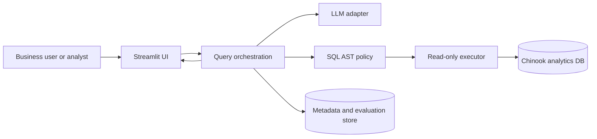
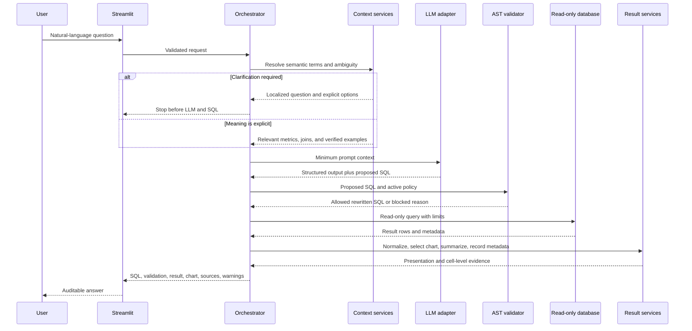

# Architecture — Release Candidate Boundary

- Status: Tahap 9 implemented; Tahap 10 local release audit in progress
- Version: 0.1.0 local release candidate
- Date: 2026-07-21

## 1. Architecture Goals

The architecture must make it difficult for probabilistic output to cross the
database trust boundary without deterministic enforcement. It must also support
an inexpensive SQLite MVP and a planned migration to PostgreSQL and FastAPI
without coupling core services to the UI or one LLM provider.

Primary goals:

1. Fail-closed SQL security.
2. Database-grounded answers.
3. Least-privilege execution.
4. Provider-neutral LLM integration.
5. Offline deterministic tests.
6. Versioned schema, prompts, semantics, and evaluations.
7. Clear audit evidence without excessive data retention.

## 2. System Context



The Tahap 6 regression fixture calls orchestration in-process. The Tahap 8
frontend is an API client; FastAPI owns orchestration and both server-side
database connections.

## 3. Trust Boundaries

### Untrusted

- User questions and clarification text.
- LLM output, including structured fields and SQL.
- Text values returned from the analytics database.
- Imported configuration and semantic files until validated.
- External dataset downloads until verified.

### Enforcement Layers

- Pydantic input and structured-output validation.
- SQLGlot AST parser and validator.
- Schema/table/column allowlists.
- Function and system-catalog policy.
- Row, column, byte, and time budgets.
- SQLite read-only mode for the MVP.
- PostgreSQL `analytics_readonly` role for the final runtime.
- Network, credential, and secret configuration.

The LLM and its system prompt are not enforcement layers.

## 4. Primary Request Flow



No numeric answer may be returned before the database result exists.

### Tahap 4 Implemented Boundary

`SecureQueryOrchestrator` is now the only composition-root path from generated
SQL to `ManualQueryExecutor`. It requires a successful `SQLSecurityService`
report and passes only the rewritten `executed_sql` to the executor. A blocked
report carries stable violation codes and no executable SQL. The older Tahap 3
runtime names are compatibility aliases to the secured Tahap 4 runtime.

The validator parses one SQLite-dialect statement, walks the entire AST,
qualifies columns against the snapshot-derived schema on an AST copy, derives
physical sources, checks function/catalog/complexity policies, rewrites the
outer limit, and fingerprints a literal-redacted AST. SQLite URI `mode=ro` and
`PRAGMA query_only=ON` remain an independent final enforcement layer.

## 5. Component Responsibilities

### Streamlit UI

- Collects question and clarification input.
- Displays pipeline state, SQL, validation, result, chart, sources, and errors.
- Does not enforce SQL security.
- Does not receive database credentials in the final architecture.

### Query Orchestrator

- Owns the explicit request state machine.
- Calls specialized services in the required order.
- Stops immediately when policy fails.
- Produces stable status and error contracts.
- Records safe audit metadata.

### Schema Service

- Inspects tables, columns, types, keys, and views.
- Normalizes metadata and produces a schema snapshot and hash.
- Does not build metadata SQL through raw user-input concatenation.

### Semantic and Clarification Services

- Load four versioned YAML artifacts: glossary, metrics, approved joins, and
  verified queries.
- Validate versions, schema hash, table/column references, metric expressions,
  foreign-key-backed joins, synonym conflicts, and cross-references.
- Detect ambiguity deterministically before the LLM and create localized,
  explicit clarification options without inventing a default.
- Map an explicit resolution to canonical metric IDs and visible assumptions.
- Retrieve only bounded, relevant, non-draft verified examples.
- Provide a content hash and only the relevant semantic subset to generation.

### LLM Adapter

- Converts a versioned prompt request into a structured response.
- Has no analytics database credentials.
- Does not execute SQL.
- Is replaceable without changing the domain contract.

### SQL Policy Layer

- Parses the entire SQL statement using the configured dialect.
- Fails closed on parse error.
- Recursively validates statement type, CTEs, subqueries, set operations,
  references, functions, and catalog access.
- Applies the configured maximum limit.
- Separates generated SQL from executed SQL.
- Computes a safe fingerprint.

### Read-Only Executor

- Uses the analytics engine only after policy approval.
- Applies transaction/read-only controls and timeouts where supported.
- Enforces response budgets and measures latency.
- Sanitizes execution errors.

### Result Services

- Preserve raw values and build a parallel formatted presentation.
- Infer identifiers, temporal dimensions, measures, and categories from actual
  returned values.
- Select KPI, bar, line, scatter, or table deterministically from returned
  columns only.
- Ground every numeric explanation in an exact returned cell.
- Emit explicit success, empty, clarification, blocked, unsupported, timeout,
  and error states.
- Never invent missing values or assume an absent currency code.

### Metadata and Evaluation Services

- Store bounded in-memory request metadata and fixed-category feedback.
- Export bounded CSV with spreadsheet-formula neutralization.
- Expose schema-only Database Explorer data and allowlisted System Info.
- Avoid raw question, SQL, and result-row storage by default.
- Attach version provenance to evaluation results.

## 6. MVP Deployment Shape

```text
Single local Python environment
  Streamlit
    -> in-process orchestration services
      -> Fake or optional real LLM adapter
      -> SQLGlot policy
      -> read-only SQLite Chinook file
```

This shape is for development and portfolio MVP validation. It is not the final
production security architecture.

## 7. Final Deployment Shape

```text
Browser
  -> Streamlit frontend
    -> FastAPI backend
      -> LLM provider adapter
      -> PostgreSQL analytics database (analytics_readonly)
      -> PostgreSQL metadata database/schema (separate credential)
```

Container, TLS, authentication, rate limiting, secret management, and monitoring
are added only after the MVP security and evaluation gates pass.

## 8. Versioned Artifacts

Every significant run should be traceable to:

- Application version.
- Git commit.
- Dataset version and checksum.
- Schema snapshot hash.
- Prompt version.
- Semantic-layer version.
- Evaluation dataset version.
- LLM provider/model when a real provider is used.

The Tahap 5 semantic layer currently uses version `v1`, schema hash
`58c6c16d147308c44996f88c3b893c0baa264a9b0ca6d06418f1ba3f199def7c`,
and content hash
`3dc2a621c4eab93d8685a075569a65dfafed43c76eb082de511313f16f4ee3be`.
Changing any semantic artifact changes the content hash and the standard
verification command reruns semantic validation and evaluation.

The Tahap 6 result contract is evaluated as `stage-6-v1`. It preserves the same
database and semantic provenance while adding result identity, chart contract,
cell-evidence, CSV, history-privacy, and UI checks. Details are recorded in
`docs/result-experience.md`.

The Tahap 7 formal corpus is `stage-7-v1`, content-addressed by the JSONL source
hash, and split into 70 development and 30 holdout labels. The offline runner
composes the existing semantic, fake-generation, AST-policy, read-only
execution, and result-processing boundaries instead of creating an evaluation
shortcut. Per-case reports retain statuses and safe reason codes but do not
duplicate raw SQL or expected/result rows. Regression comparison requires
matching dataset, schema, prompt, semantic, provider, and model provenance.

## 9. Initial Repository Boundaries

The target repository grows only as each phase needs files:

```text
ai-database-analyst/
|-- PROJECT_STATUS.md
|-- DECISIONS.md
`-- docs/
    |-- requirements.md
    |-- architecture.md
    |-- threat-model.md
    |-- data-source.md
    `-- question-inventory.md
```

Tahap 1 will add the minimal installable/testable Python foundation. Empty files
for future phases are intentionally not created during Tahap 0.

## 10. Architecture Invariants

1. No LLM-generated SQL executes without full deterministic validation.
2. No runtime analytics connection uses owner or superuser privileges.
3. Generated SQL and executed SQL remain distinguishable.
4. Numeric claims are grounded in executed query results.
5. Tests can run without an API key or network.
6. Secrets do not enter Git, logs, reports, images, or client responses.
7. A phase cannot claim completion without evidence from its quality gate.
8. An unresolved business ambiguity stops before LLM generation and SQL.
9. Semantic context is schema-bound, versioned, content-addressed, and bounded.
10. Verified query examples are retrieval references, never an execution
    bypass or evaluation answer key.
11. Formal execution accuracy compares database results, not exact SQL text.
12. A known-unsafe blocking decrease always fails the regression gate.
13. Analytics and metadata credentials are distinct and exact-role identities
    are verified at runtime.
14. Browser-facing code has no database credential and cannot bypass FastAPI.
15. Container images use pinned bases, explicit copies, non-root users, and no
    embedded runtime credential.
16. A canonical request ID crosses frontend, API, orchestration, SQL policy,
    database execution, and privacy-safe logs.

## 11. Tahap 8 Productionization Boundary

The official PostgreSQL artifact is loaded into owner-only `chinook_data` and
exposed through an `analytics` compatibility-view schema. The runtime must
connect as `analytics_readonly`, enters a read-only transaction, constrains its
search path, and applies statement and result budgets. A separate
`analyst_metadata` database stores ten privacy-minimized models in
`app_metadata`; Alembic runs as `migration_user`, while API DML uses only
`app_metadata_user`.

FastAPI is composed through an app factory and dependency injection. Its v1
surface exposes health, query, schema, history, feedback, and a token-protected
evaluation summary. Pydantic rejects extra input, CORS is bounded, and all
exception paths return client-safe contracts. Streamlit uses a typed HTTP
client and receives no database URL.

The implementation has passed static contracts, offline migration generation,
and deterministic tests. A live ephemeral PostgreSQL container also proved
role-level write rejection, owner-table denial, migration from empty, credential
isolation, and end-to-end durable metadata persistence. The runner removes its
named container after testing and keeps temporary passwords out of process
arguments.

## 12. Tahap 9 Container and Operations Boundary

Compose adds a healthy PostgreSQL service, a one-shot bootstrap/migration job,
FastAPI, and Streamlit. PostgreSQL is confined to an internal network and a
named development volume. API and frontend attach only to the networks they
need, publish localhost ports, run as UID/GID `10001:10001`, and use read-only
root filesystems with temporary `/tmp` storage. Runtime credentials are
required substitutions from an ignored generated environment file; they are
never defaults or image build arguments.

The API middleware validates or generates one canonical UUID and binds it to
the asynchronous request context. The orchestrator reuses it, the response
returns it, and structured analytics logs carry it with stage/status/model,
prompt/schema/fingerprint provenance, latency, row count, and safe error code.
A protected in-process metrics endpoint exposes counters and rates without raw
questions, SQL, result rows, URLs, headers, or credentials.

Four least-privilege GitHub Actions workflows cover offline quality on Python
3.11/3.12, live PostgreSQL/API integration, dependency/source/SQL/container
security, scheduled evaluation, and a no-cache Compose smoke test. Actions are
pinned by full commit SHA, checkout credentials are not persisted, and no
workflow references a repository secret. Registry publication is absent until
an authorized tag/release configuration exists.

## 13. Known Open Architecture Questions

- Exact real LLM provider and structured-output mechanism.
- Authentication for a public demo.
- Production hosting and secret manager.
- Whether semantic retrieval needs embeddings after the Chinook baseline.
- Currency and timezone policy for any future mixed-source dataset.
- Durable multi-turn storage for clarification selections and assumptions.

These questions are not blockers for local reproducibility. The provider,
authentication, hosting, and secret-manager decisions are blockers for a
public production claim.

## 14. Tahap 10 Release Boundary

The repository is preparing a locally reproducible portfolio release. The
implemented runtime remains Streamlit → FastAPI → PostgreSQL, with the fake
deterministic provider as its only verified default. `SECURITY.md` defines the
reporting and public-exposure boundary; `deployment.md` defines managed
database, secret, TLS, authentication, rate-limit, migration, smoke-test, and
rollback requirements.

No public cloud resource, hostname, registry, real-provider credential, or
GitHub remote is part of the current evidence. Those are external release
decisions, not inferred implementation details. A future deployment may claim
completion only when its exact platform, cost approval, identities, secret
manager, HTTPS route, authentication/authorization, rate limits, health/log
evidence, and rollback result are recorded.
