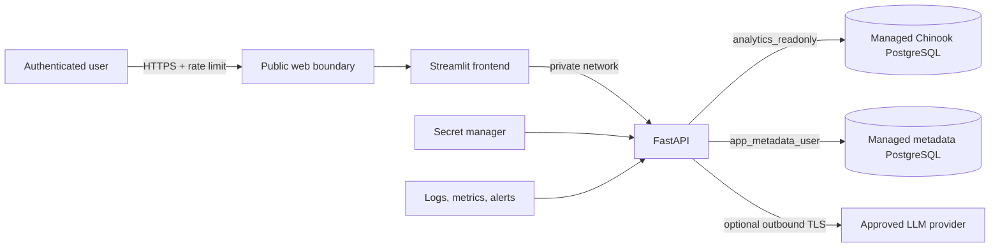

# Deployment and Rollback Guide

- Status: Railway private staging health-gated; application not public
- Scope: managed PostgreSQL, FastAPI, Streamlit, and optional real LLM
- Last reviewed: 2026-08-22

## Decision boundary

The MIT-licensed source is published in the authorized public GitHub repository,
and its hosted CI/security/evaluation evidence is recorded. Railway is selected
for a private staging path and the `ai-database-analyst` project is linked
locally to `staging`. The default `production` environment remains empty. The
owner's Hobby-plan authorization enabled healthy private PostgreSQL, FastAPI,
and Streamlit services in Singapore. The ephemeral bootstrap seeded Chinook,
applied Alembic to head, removed its privileged variables, and was deleted. API
and frontend passed Railway deployment healthchecks. No public domain, public
database proxy, Git credential, or real-provider secret exists, so this is not
a public deployed demo; public routing remains blocked on authentication,
authorization, and rate limiting. See
`railway-deployment-plan.md` for the live checklist.

## Railway connection state

Railway does not run this repository's Compose file directly. The intended
translation is managed PostgreSQL, a one-shot bootstrap/migration service,
private FastAPI, and Streamlit. Database and API traffic use Railway private
networking. The current containers bind fixed ports, so Railway service
variables must set API `PORT=8000` and frontend `PORT=8501`; deployment
healthchecks use `/api/v1/health` and `/_stcore/health`.

The API and frontend services are attached to the public GitHub repository and
track `agent/railway-staging`. Both build the exact commit recorded by Railway
through `Dockerfile.api` and `Dockerfile.frontend`; local CLI actions also
target `staging`, not `production`. Move both deployment triggers to `main`
only after the reviewed stacked branches are merged.

## Required production topology

The platform must support HTTPS, private service networking, a managed secret
store, health probes, immutable image deployment, log access, and fast rollback.
Managed PostgreSQL must support encrypted transport, backups, point-in-time or
snapshot recovery, and distinct database roles.

## Pre-deployment gate

1. Verify the selected MIT project license and dataset attribution obligations.
2. Confirm the authorized public repository and recorded hosted CI evidence.
3. Run `verify`, `test-postgres`, `docker-smoke`, `security-stage9`, and
   `test-clean-checkout` against the exact release source.
4. Pin image digests and record application, dataset, schema, prompt, semantic,
   evaluation, provider, and model versions.
5. Choose a secret manager; create separate randomly generated analytics,
   metadata, migration, evaluation, and database-owner credentials.
6. Define authentication, authorization, request/body limits, per-user and
   per-IP rate limits, egress policy, log retention, and alert thresholds.
7. Review the LLM provider's region, retention, training, abuse-monitoring, and
   deletion terms before setting `LLM_PROVIDER` to anything other than `fake`.
8. Back up the target database and record the rollback image and migration
   revision.
9. Apply Alembic through revision `20260816_0002` (or current `head`) before
   enabling `/api/v1/agent/*`; verify that only privacy-minimized continuation
   metadata is retained.

## Safe release procedure

1. Build immutable API and frontend images from the reviewed commit.
2. Scan the final images and configuration before pushing them to a private or
   approved registry.
3. Provision PostgreSQL privately and load the pinned Chinook v1.4.5 artifact.
4. Create the four exact roles through an audited administrative channel.
5. Run Alembic as `migration_user`; never run application traffic with this
   credential.
6. Deploy FastAPI privately, inject secrets at runtime, and verify
   `/api/v1/health` before routing traffic.
7. Deploy Streamlit with only `API_BASE_URL`; it must receive no database or LLM
   secret.
8. Enable HTTPS, authentication, authorization, rate limits, request timeouts,
   network policy, and monitoring before public routing.
9. Shift traffic gradually and retain the previous images until smoke tests and
   an observation window pass.

## Post-deployment smoke tests

Use synthetic Chinook questions only and retain request IDs, statuses, timings,
and redacted fingerprints—not raw payloads.

| Path | Test | Expected outcome |
|---|---|---|
| Health | `GET /api/v1/health` | `200`, `healthy`, API version `v1` |
| Success | “Berapa jumlah pelanggan?” | success, value `59`, AST-safe badge |
| Clarification | “Siapa pelanggan terbaik?” | clarification before LLM/SQL |
| Blocked | request that attempts destructive SQL/prompt injection | blocked, no execution |
| Timeout | controlled test at a non-production limit | safe timeout contract |
| Privacy | inspect logs for test request IDs | no raw question, SQL, rows, token, or URL |
| Metrics | authenticated operations endpoint | aggregate counters only |

Also confirm database writes fail as `analytics_readonly`, metadata access uses
only `app_metadata_user`, physical owner tables remain denied, and alerts can be
delivered to the chosen operator.

## Rollback

Rollback is triggered by failed health, elevated error/timeout rates, security
regression, incorrect results, migration failure, or sensitive-data evidence.

1. Stop traffic shifting and disable the affected release.
2. Restore the last known-good API/frontend image digests.
3. If the migration is backward compatible, leave the database at the newer
   revision and roll application code back first.
4. If a database rollback is required, stop writers, capture a new backup, run
   only a reviewed Alembic downgrade, and restore from the pre-release backup
   if validation fails. Never improvise destructive SQL in production.
5. Rotate any potentially exposed credential and invalidate active sessions.
6. Repeat health, success, clarification, blocked, authorization, and privacy
   smoke tests.
7. Record the incident, release identifiers, decision owner, timestamps, and
   remediation without storing sensitive payloads.

The local `docker compose down --volumes` command is a destructive development
reset, not a production rollback mechanism.
