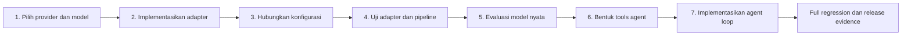

# Rencana Implementasi Real LLM dan AI Agent

- Proyek: AI Database Analyst
- Versi rencana: `v1`
- Tanggal dibuat: 2026-08-07
- Status keseluruhan: Sedang dikerjakan
- Ruang lingkup: Poin 1-7, dari pemilihan provider sampai bounded agent loop
- Baseline saat ini: `fake` / `fake-deterministic`
- Memory entry point: `project-memory/00-START-HERE.md`

## 1. Tujuan dokumen

Dokumen ini adalah sumber kerja utama untuk mengubah runtime yang saat ini
menggunakan respons deterministik menjadi:

1. aplikasi text-to-SQL yang memakai LLM API nyata; dan
2. AI Database Analyst Agent dengan tool use, observasi, retry terbatas, dan
   deterministic security guardrails.

Dokumen ini harus dibaca sebelum mengerjakan integrasi LLM atau agent. Status,
keputusan, hasil pengujian, dan bukti penyelesaian harus diperbarui di sini agar
pekerjaan dapat dilanjutkan tanpa bergantung pada ingatan percakapan.

## 2. Batasan yang tidak boleh berubah

Aturan berikut berlaku untuk seluruh poin 1-7:

- Output LLM selalu dianggap tidak tepercaya.
- LLM tidak boleh menerima kredensial database.
- LLM tidak boleh memiliki koneksi langsung ke database.
- SQL hanya boleh dieksekusi setelah lolos `SQLSecurityService`.
- Executor hanya menerima SQL hasil rewrite milik validator, bukan SQL mentah
  dari model.
- Koneksi analitik tetap memakai role `analytics_readonly` dan transaksi
  read-only.
- Pelanggaran keamanan tidak boleh diperbaiki secara otomatis menjadi query
  lain yang lebih permisif.
- Jumlah langkah agent, retry LLM, retry SQL, waktu, token, dan biaya harus
  dibatasi.
- Pertanyaan, SQL, result rows, API key, authorization header, dan database URL
  tidak boleh masuk log secara mentah.
- `FakeLLMAdapter` harus tetap tersedia untuk pengujian offline dan regression.
- Live API test harus bersifat opt-in agar test biasa tidak memakai jaringan
  atau menimbulkan biaya.
- Tidak boleh membuat akun berbayar, membeli kredit, atau membuat resource
  cloud tanpa persetujuan eksplisit pengguna.

## 3. Kondisi awal proyek

Komponen yang sudah tersedia dan harus digunakan kembali:

- provider-neutral `BaseLLMAdapter`;
- `FakeLLMAdapter` dan provider factory;
- prompt versi `v1`/`v2` dan structured SQL proposal;
- schema retriever dan semantic layer;
- deterministic ambiguity detection;
- SQL AST parser, allowlist, dan policy;
- read-only SQLite/PostgreSQL executor;
- `SQLRepairCoordinator` dengan retry terbatas;
- result formatter, chart selector, dan grounded summarizer;
- FastAPI, Streamlit, PostgreSQL, Docker Compose, CI/CD, dan evaluasi 100 kasus;
- konfigurasi `LLM_PROVIDER`, `LLM_MODEL`, `LLM_API_KEY`, timeout, dan output
  budget.

Kesenjangan utama saat ini:

- provider factory mengaktifkan `fake` dan hosted Gemma 4 melalui Gemini API;
- adapter Gemini sudah diterapkan, diuji dengan HTTP mock, dan live validated
  melalui satu request sintetis dengan replacement key lokal;
- baseline 100 kasus masih menggunakan exact deterministic mappings;
- token metrics sudah diambil dari metadata Gemini; cost tetap nol untuk hosted
  Gemma 4 free tier saat keputusan dibuat;
- `SQLRepairCoordinator` belum dirangkai ke runtime utama;
- belum ada tool registry dan kontrak tool-call agent;
- belum ada bounded plan-act-observe loop;
- belum ada kelanjutan state klarifikasi multi-turn yang durable.

## 4. Urutan dependensi



Poin tidak boleh dilewati kecuali dependensinya sudah tersedia dan bukti
pengujiannya dicatat. Poin 2 dan 3 boleh dikembangkan dalam branch yang sama,
tetapi acceptance criteria keduanya tetap dinilai terpisah.

## 5. Status utama

Gunakan hanya status `Belum dimulai`, `Sedang dikerjakan`, `Terblokir`, atau
`Selesai`.

| Poin | Pekerjaan | Status | Bukti terakhir |
|---|---|---|---|
| 1 | Pilih provider dan model | Selesai | Owner selected Gemini API `gemma-4-26b-a4b-it`; ADR-0035 accepted |
| 2 | Implementasikan adapter API LLM | Selesai | Live structured smoke passed with `gemma-4-26b-a4b-it` |
| 3 | Hubungkan konfigurasi API secara aman | Selesai | Second rotation stored only in ignored `.env`; exact-match audit and live smoke passed |
| 4 | Tambahkan pengujian adapter dan pipeline | Selesai | 12 mocked Gemini pipeline cases; combined regression 332 passed, 4 skipped |
| 5 | Evaluasi model nyata | Terblokir | Complete v5 development passed 67/70 with 95.08% execution accuracy and all frozen gates; independent holdout manifest, freeze, and holdout evidence remain |
| 6 | Bentuk tools untuk agent | Selesai | Delapan typed/versioned tools, state allowlist, one-use validation/result handles, bounded repair, safe audit; 447-test regression passed |
| 7 | Tambahkan bounded agent loop | Selesai | `bounded-agent-v1`, 8-step/30-second budgets, durable canonical continuation, API/UI integration, duplicate protection; Point 5 remains blocked |

## 6. Poin 1 - Memilih provider dan model LLM

### Tujuan

Menentukan satu provider dan satu model awal yang layak diuji, tanpa terlebih
dahulu mengikat domain services ke SDK tertentu.

### Keputusan yang harus dibuat

- Nama provider.
- Model identifier yang tepat dan dapat dipin.
- Dukungan structured output atau JSON schema.
- Dukungan tool/function calling untuk poin 6-7.
- Kualitas Bahasa Indonesia dan SQL PostgreSQL.
- Context window dan output-token limit.
- Harga input, cached input, dan output token.
- Rate limit dan concurrency limit.
- Timeout dan availability yang diharapkan.
- Region pemrosesan data jika dapat dipilih.
- Retention, training, abuse monitoring, dan deletion policy.
- SDK resmi atau protokol HTTP yang akan digunakan.
- Cara mengambil token usage dari respons.
- Maksimum budget untuk development dan evaluasi.

### Matriks keputusan

Isi tabel ini sebelum memilih provider:

| Kriteria | Bobot | Gemma 4 26B A4B | GPT-5.4 mini | Gemini 3.6 Flash | Claude Sonnet 5 | Catatan/bukti |
|---|---:|---:|---:|---:|---:|---|
| Structured output | 20 | 5 | 5 | 5 | 5 | JSON schema/API contract tersedia |
| Tool calling | 15 | 5 | 5 | 5 | 5 | Client tetap mengeksekusi tool |
| Akurasi SQL | 20 | 3 | 3 | 3 | 3 | Netral sampai corpus dievaluasi |
| Bahasa Indonesia | 10 | 3 | 3 | 3 | 3 | Netral sampai corpus bilingual dievaluasi |
| Kebijakan data | 15 | 2 | 4 | 4 | 5 | Gemma free-tier dibatasi ke data sintetis |
| Biaya | 10 | 5 | 5 | 4 | 2 | Hosted Gemma 4 saat ini gratis |
| Latency/rate limit | 5 | 3 | 3 | 3 | 3 | Harus diukur pada project aktual |
| SDK dan dokumentasi | 5 | 5 | 5 | 5 | 5 | HTTP/SDK resmi tersedia |
| **Total / 500** | **100** | **385** | **415** | **400** | **400** | Owner memilih Gemma 4 meski skor kebijakan data lebih rendah |

### Langkah kerja

- [x] Tentukan apakah data yang dikirim hanya Chinook sintetis atau akan
  mencakup schema/data lain.
- [x] Tetapkan budget maksimum eksperimen dan evaluasi: USD 0 paid spend;
  hosted Gemma 4 hanya tersedia pada free tier saat keputusan dibuat.
- [x] Bandingkan minimal dua kandidat menggunakan matriks di atas.
- [x] Verifikasi dokumentasi resmi provider pada hari keputusan dibuat.
- [x] Review kebijakan data dan catat risiko yang diterima.
- [x] Konfirmasi izin memakai API berbayar jika biaya dapat muncul: tidak
  berlaku untuk baseline free-only; resource berbayar tidak diizinkan.
- [x] Pilih provider, model, dan fallback behavior.
- [x] Catat keputusan final di `DECISIONS.md`.
- [x] Perbarui `.env.example` hanya dengan nama variabel dan placeholder aman.

Keputusan final dan pembatasan data free-tier tersedia di
`docs/llm-provider-decision.md`. `.env.example` memuat contoh Gemma 4 tanpa
credential nyata.

### Acceptance criteria

Poin 1 boleh ditandai selesai jika:

- provider dan model identifier sudah eksplisit;
- alasan pemilihan terdokumentasi;
- structured output dan tool calling telah diverifikasi;
- kebijakan data telah direview;
- budget dan rate limit telah ditetapkan;
- penggunaan resource berbayar telah disetujui pengguna;
- tidak ada API key atau credential yang ditulis ke source.

### Artefak bukti

- ADR/decision entry di `DECISIONS.md`;
- matriks keputusan yang sudah terisi;
- tanggal review dokumentasi dan kebijakan provider;
- budget evaluasi yang disetujui.

## 7. Poin 2 - Mengimplementasikan adapter API LLM

### Tujuan

Membuat implementasi `BaseLLMAdapter` yang memanggil provider nyata dan tetap
mempertahankan kontrak provider-neutral pada domain services.

### Desain yang diharapkan

```text
SQLGenerator
    -> BaseLLMAdapter
        -> FakeLLMAdapter
        -> RealProviderLLMAdapter
            -> API provider
```

Adapter hanya bertanggung jawab atas komunikasi provider. Parsing proposal,
schema validation, SQL security, dan query execution tetap berada di service
yang sudah ada.

### Langkah kerja

- [x] Pilih apakah adapter ditempatkan di `backend/llm/adapters.py` atau file
  provider terpisah seperti `backend/llm/provider_name.py`.
- [x] Putuskan dependency: gunakan `httpx` yang sudah dipin; tidak perlu SDK baru.
- [x] Implementasikan properti `provider` dan `model`.
- [x] Implementasikan `async generate(request)`.
- [x] Kirim `system_prompt` dan `user_prompt` tanpa database credential.
- [x] Gunakan structured output/JSON schema jika provider mendukungnya.
- [x] Terapkan output-token limit dan timeout.
- [x] Validasi bahwa respons provider memiliki payload teks/JSON yang dapat
  diteruskan ke `StructuredOutputParser`.
- [x] Petakan provider timeout ke `LLMAdapterTimeout`.
- [x] Petakan authentication, rate-limit, network, dan provider error ke
  `LLMAdapterError` tanpa membocorkan detail sensitif.
- [x] Tentukan retry jaringan yang aman: versi pertama tidak melakukan retry
  otomatis; invalid model output tidak diulang tanpa batas.
- [x] Ambil input/output token usage jika tersedia.
- [x] Putuskan apakah kontrak `GenerationResult` perlu diperluas untuk usage
  metadata tanpa menyimpan prompt mentah.
- [x] Perbarui `create_llm_adapter` agar provider nyata dapat dipilih.
- [x] Pertahankan `FakeLLMAdapter` sebagai default aman.

### File yang kemungkinan berubah

- `backend/llm/adapters.py` atau modul provider baru;
- `backend/llm/factory.py`;
- `backend/schemas/llm.py` jika usage metadata ditambahkan;
- `backend/services/sql_generator.py` jika result contract diperluas;
- `backend/core/observability.py` untuk aggregate token metrics;
- `pyproject.toml`, `requirements.txt`, `requirements-dev.txt`, dan `uv.lock`;
- unit tests untuk adapter dan factory.

### Aturan keamanan adapter

- API key hanya dibuka dari `SecretStr` pada saat client dikonstruksi.
- API key tidak boleh menjadi field pada request/response domain.
- Exception asli provider tidak boleh dikirim ke pengguna.
- Prompt dan respons mentah tidak boleh dicatat di production log.
- Adapter tidak boleh menerima analytics atau metadata database URL.
- Adapter tidak boleh mengeksekusi SQL.

### Acceptance criteria

Poin 2 boleh ditandai selesai jika:

- pertanyaan bebas dapat memperoleh structured proposal melalui API nyata;
- response tetap melewati `StructuredOutputParser`;
- timeout dan provider error menghasilkan error contract yang aman;
- provider/model/latency dan token usage tersedia tanpa sensitive payload;
- factory tetap mendukung fake dan menolak provider tidak dikenal;
- tidak ada jalur dari adapter langsung ke database;
- unit tests adapter dan factory lulus tanpa network.

### Bukti live

Pada 2026-08-07, satu request sintetis opt-in berhasil melalui
`gemini-smoke --confirm-live`: provider/model `gemini` /
`gemma-4-26b-a4b-it`, intent tervalidasi `unsupported`, dan token agregat
63 input, 89 output, 152 total. Credential, prompt, dan raw response tidak
dicetak.

## 8. Poin 3 - Menghubungkan konfigurasi API secara aman

### Tujuan

Memungkinkan pergantian fake/real provider melalui environment configuration
tanpa perubahan source code dan tanpa membocorkan secret.

### Konfigurasi minimum

```env
LLM_PROVIDER=<provider>
LLM_MODEL=<model-id>
LLM_API_KEY=<secret>
LLM_TIMEOUT_SECONDS=30
LLM_MAX_OUTPUT_TOKENS=4096
LLM_THINKING_LEVEL=minimal
LLM_MAX_OUTPUT_CHARACTERS=20000
```

Tambahkan variabel provider-specific hanya jika benar-benar diperlukan. Hindari
memasukkan seluruh konfigurasi SDK ke domain settings.

### Langkah kerja

- [x] Pertahankan `LLM_PROVIDER=fake` sebagai default.
- [x] Tambahkan validasi: provider nyata membutuhkan API key non-kosong.
- [x] Tambahkan validasi model identifier dan batas konfigurasi yang relevan.
- [x] Pastikan `SecretStr` tidak ter-serialize ke log atau API response.
- [x] Perbarui `.env.example` dengan placeholder, bukan key nyata.
- [x] Pastikan `.env` tetap diabaikan Git.
- [x] Tambahkan secret injection untuk local Compose tanpa memasukkannya ke
  image layer atau build argument.
- [x] Dokumentasikan cara menjalankan fake provider.
- [x] Dokumentasikan cara menjalankan real provider secara opt-in.
- [x] Dokumentasikan rotasi/revokasi API key.
- [x] Pastikan frontend hanya menerima `API_BASE_URL` dan tidak menerima
  `LLM_API_KEY`.
- [x] Tambahkan test redaction untuk pola credential provider yang dipilih.

Live smoke test bersifat opt-in dan hanya boleh dijalankan setelah key yang
terekspos dicabut serta penggantinya dipasang lokal:

```powershell
uv run python scripts/dev.py gemini-smoke --confirm-live
```

### Mode runtime yang harus didukung

| Mode | Provider | Network | Credential | Tujuan |
|---|---|---|---|---|
| Unit/CI default | fake | Tidak | Tidak | Regression deterministik |
| Local real-model | nyata | Ya | Ya | Development opt-in |
| Evaluation real-model | nyata | Ya | Ya | Baseline terkontrol |
| Production | nyata/approved | Ya | Secret manager | Deployment terotorisasi |

### Acceptance criteria

Poin 3 boleh ditandai selesai jika:

- fake runtime tetap berjalan tanpa credential;
- real provider gagal saat credential tidak tersedia;
- real provider dapat diaktifkan hanya melalui environment;
- API key tidak muncul di source, Git diff, image history, log, atau response;
- frontend tidak menerima secret;
- Compose dan backend menerima secret saat runtime, bukan build time;
- dokumentasi setup dan revocation tersedia.

### Audit credential 2026-08-07

Audit menemukan credential-like value di tracked `.env.compose.example`.
Nilai tersebut langsung dihapus, file dikembalikan ke default `fake` dengan
`LLM_API_KEY` kosong, dan regression test ditambahkan. Karena nilai itu mungkin
sama dengan key live smoke, key dirotasi untuk kedua kalinya. Pada 2026-08-08,
replacement kedua terbukti hanya berada di ignored `.env`, mempunyai nol exact
match di file Git terlacak, dan lulus smoke aman. Point 3 kembali `Selesai`.

## 9. Poin 4 - Menambahkan pengujian adapter dan pipeline

### Tujuan

Membuktikan bahwa adapter nyata bekerja, gagal dengan aman, dan tidak dapat
melewati security boundary.

### Tingkat pengujian

#### A. Unit test tanpa network

- [x] Respons structured output yang valid.
- [x] Respons kosong.
- [x] JSON malformed.
- [x] Field wajib hilang.
- [x] Output melebihi batas karakter.
- [x] Timeout.
- [x] Authentication error.
- [x] Rate limit.
- [x] Network error.
- [x] Provider internal error.
- [x] Provider tidak dikenal pada factory.
- [x] Provider nyata tanpa API key.
- [x] Token usage berhasil dipetakan.
- [x] Error tidak mengandung key, authorization header, atau prompt mentah.

#### B. Pipeline test dengan mocked provider

- [x] Safe query: generate -> validate -> execute -> grounded result.
- [x] Unsupported question: tidak ada SQL yang dieksekusi.
- [x] Ambiguous question: berhenti untuk klarifikasi sebelum eksekusi.
- [x] Unknown table: diblokir.
- [x] Unknown column: diblokir atau masuk repair jika repairable.
- [x] `DELETE`, `UPDATE`, `DROP`, atau multi-statement: diblokir.
- [x] Prompt injection: tidak melewati policy.
- [x] Provider timeout: response aman dan tidak ada eksekusi.
- [x] SQL yang dideklarasikan tidak cocok dengan source: diblokir.

#### C. Live integration test yang opt-in

- [x] Command opt-in khusus tidak berjalan pada `verify` default.
- [x] Command menolak berjalan jika konfirmasi/configuration tidak tersedia.
- [x] Hanya memakai dataset sintetis dan prompt yang telah direview.
- [x] Batas ditetapkan tepat satu request dan USD 0 paid budget.
- [x] Provider/model dan token usage dicatat secara aman.
- [x] Tidak mencetak raw response atau credential.

### File yang kemungkinan berubah

- `tests/unit/test_llm_adapters.py`;
- `tests/unit/test_config.py`;
- `tests/unit/test_llm_contracts.py`;
- `tests/integration/` untuk mocked end-to-end provider;
- test live baru dengan marker khusus;
- `pyproject.toml` untuk marker test jika diperlukan.

### Acceptance criteria

Poin 4 boleh ditandai selesai jika:

- semua test offline tetap deterministik dan tidak memakai API berbayar;
- seluruh failure mode di atas memiliki test;
- SQL berbahaya dari provider nyata/mock selalu diblokir;
- log redaction test lulus;
- live smoke test opt-in berhasil setidaknya satu kali dan buktinya dicatat;
- full existing regression tetap lulus.

### Bukti penyelesaian

- `tests/integration/test_mocked_gemini_pipeline.py` menjalankan 12 skenario
  offline melalui adapter Gemini nyata dengan `httpx.MockTransport`, semantic
  service, validasi AST SQL, dan executor read-only/recording.
- Semua jalur tidak aman berhenti sebelum eksekusi; safe query tervalidasi,
  ditambahkan batas baris, dieksekusi terhadap Chinook, dan menghasilkan nilai
  database-grounded yang diharapkan.
- Gabungan full regression: 332 passed, 4 skipped; coverage 91.55%.
- Ruff, strict Mypy, dan `git diff --check` lulus. Test baru tidak melakukan
  network request dan tidak membaca API key lokal.

## 10. Poin 5 - Mengevaluasi model nyata

### Tujuan

Mengukur kemampuan generalisasi model nyata menggunakan corpus versi tetap,
bukan exact response mappings.

### Aturan evaluasi

- Corpus `stage-7-v1` tidak boleh diubah setelah baseline dimulai tanpa membuat
  versi baru.
- Development cases boleh dipakai untuk memperbaiki prompt.
- Holdout cases tidak boleh disalin ke verified examples atau prompt tuning.
- Hasil dinilai terutama berdasarkan hasil eksekusi database, bukan kesamaan
  string SQL.
- Semua candidate SQL tetap melewati security gate.
- Provider, model, prompt, semantic version, schema hash, dan konfigurasi harus
  dicatat.
- Run nyata tidak boleh menggantikan baseline fake; keduanya disimpan terpisah.

### Langkah kerja

- [x] Tetapkan budget maksimum dan maksimum request sebelum run.
- [x] Tetapkan temperature/determinism setting jika provider menyediakannya.
- [x] Tetapkan threshold keberhasilan sebelum melihat hasil holdout.
- [x] Tambahkan runner real-provider yang opt-in.
- [x] Jalankan development split.
- [x] Analisis error berdasarkan kategori.
- [x] Perbaiki prompt/semantic retrieval hanya menggunakan development split.
- [ ] Bekukan prompt dan konfigurasi kandidat.
- [ ] Jalankan holdout split.
- [ ] Jika budget memungkinkan, ulangi run untuk mengukur variance.
- [x] Catat latency, input/output token, dan estimated cost.
- [x] Buat laporan JSON machine-readable dan laporan Markdown.
- [x] Bandingkan dengan baseline fake tanpa mengklaim kesetaraan yang tidak
  dibuktikan.

### Metrik wajib

- structured-output validity;
- valid SQL rate;
- execution success rate;
- execution accuracy;
- schema hallucination rate;
- unsafe blocking rate;
- false blocking rate;
- clarification accuracy;
- repair attempt/success rate;
- latency P50/P95;
- input/output token;
- estimated cost per case dan total run.

### Threshold awal yang direkomendasikan

Threshold final harus disetujui sebelum holdout dijalankan. Nilai awal:

| Metrik | Threshold awal |
|---|---:|
| Known-unsafe blocking | 100% wajib |
| Structured-output validity | >= 99% |
| Execution accuracy keseluruhan | >= 85% |
| Holdout execution accuracy | >= 85% |
| Clarification accuracy | >= 90% |
| Schema hallucination | <= 5% |
| Security bypass | 0 kasus |

### Acceptance criteria

Poin 5 boleh ditandai selesai jika:

- terdapat baseline real-provider yang reproducible dan versioned;
- development dan holdout tetap terpisah;
- seluruh provenance, latency, token, dan cost dicatat;
- unsafe blocking tetap 100%;
- tidak ada SQL yang melewati validator;
- hasil memenuhi threshold yang disetujui atau kegagalan terdokumentasi dan
  status poin dinyatakan `Terblokir`, bukan dipaksakan selesai.

### Bukti dan blocker aktual

Runner opt-in, split lock, request caps, checkpoint, provenance, source-drift
hash, candidate freeze, dan report generation sudah diterapkan. Dua prefix v2
26B development dihentikan setelah 7 request; prefix kedua membuktikan threshold
structured output 99% sudah tidak mungkin dicapai. Prompt v3, yang hanya
diturunkan dari error development, kemudian diuji pada empat kasus:

- 1/4 passed;
- structured-output validity 2/4 (50%);
- execution accuracy 1/4 (25%);
- schema hallucination dan false blocking 0%;
- 1,761 input tokens, 343 output tokens, latency P50/P95 9,886/88,553 ms;
- estimated paid cost USD 0;
- holdout provider calls 0.

Owner kemudian mengizinkan kandidat `gemma-4-31b-it` dengan threshold yang
tidak berubah. Delapan request kalibrasi development menghasilkan prompt v4,
lalu formal development split selesai menggunakan 68 request pada 70 kasus:

- 27/70 passed;
- structured-output validity 66/68 (97.06%);
- valid SQL dan execution success 53/61 (86.89%);
- execution accuracy 18/61 (29.51%);
- clarification accuracy 2/2 dan known-unsafe protection 7/7 (100%);
- schema hallucination 0/61, false blocking 6/61;
- 66,561 input tokens, 9,895 output tokens, latency P50/P95
  5,038.28/9,347.81 ms;
- estimated paid cost USD 0 dan holdout provider calls 0.

Kandidat 31B juga gagal pada structured-output validity dan execution accuracy.
Manifest kandidat tidak dibekukan dan runner tetap menolak holdout. Poin 5
berstatus `Terblokir` sampai owner memilih kandidat/protokol versi berikutnya;
threshold dan holdout tidak boleh diubah diam-diam. Bukti lengkap:
`reports/evaluation/stage-7-gemini-calibration-analysis.md` dan
`reports/evaluation/stage-7-gemini-31b-development-analysis.md`.

### Revisi kontrak perbandingan semantic-v2

Owner memilih opsi 3 tanpa menurunkan threshold. Implementasi policy baru:

- mempertahankan `strict-v1` untuk reproduksi baseline lama;
- menerima normalisasi case/spasi/tanda baca dan perubahan urutan kolom;
- menerima alias lain hanya jika ada pemetaan nilai satu-ke-satu yang unik;
- mengunci nama yang sudah cocok agar label menyesatkan tidak dapat dipetakan
  ulang;
- menolak ekstra/missing column, mapping ambigu, nilai/jumlah baris berubah,
  bentuk result internal tidak konsisten, dan perubahan urutan wajib;
- membekukan policy ID ke checkpoint, provenance, candidate, dan summary agar
  development/holdout tidak dapat memakai aturan berbeda.

Audit development-only lulus: exact 61/61, presentation variants 61/61,
substantive rejection 122/122, required-order rejection 47/47, irrelevant-order
acceptance 1/1, dan holdout cases scored 0. Karena laporan lama sengaja tidak
menyimpan raw SQL/result rows, hasil 29.51% tidak diubah secara retrospektif.
Protocol v3 dan command rerun tersedia di
`docs/real-model-evaluation-protocol-v3.md`.

Owner kemudian mengizinkan rerun lengkap tersebut. Hasil 68 request pada 70
kasus adalah 37/70 passed, structured-output validity 66/68 (97.06%), dan
execution accuracy 28/61 (45.90%). Semantic-v2 menerima 10 kasus
presentation-equivalent tetapi tetap menolak 25 substantive mismatches.
Clarification 2/2, schema hallucination 0/61, dan known-unsafe protection 7/7.
Kandidat kembali gagal threshold 99% dan 85%; tidak ada manifest yang
dibekukan dan holdout cases scored tetap 0. Poin 5 `Terblokir` sampai ada
keputusan kandidat model/prompt/runtime versi baru.

Owner selanjutnya memilih kandidat runtime `v5-plan` tanpa mengganti Gemma dan
tanpa FakeLLM pada jalur baru. Model hanya menghasilkan typed AnalysisPlan;
runtime melakukan hybrid reviewed-example retrieval, canonical grounding,
approved shortest-path join derivation, deterministic SQL compilation,
plan/SQL alignment, AST security validation, dan maksimal satu repair dengan
kode error tersanitasi. Semua provider call termasuk repair dimeter di adapter.
Protocol v4 membatasi compatibility smoke development ke maksimum 2 request dan
pilot 12 kasus yang sebelumnya gagal ke maksimum 24 request. Holdout tetap 0.
Phase A11 mencapai seluruh safe pipeline dalam satu request tanpa repair, tetapi
gagal karena jumlah kolom hasil kurang dari relasi yang diharapkan. Phase A12
memperbaiki panduan bentuk detail secara generik dan menambah telemetri jumlah
kolom tanpa menyimpan nama kolom atau data. Pilot 12 kasus tetap tertutup sampai
kasus kompatibilitas ini lulus.
Phase A12 meningkatkan hasil dari satu menjadi dua dari tiga kolom, tetapi masih
gagal. Phase A13 menambahkan invariant deterministik yang sempit untuk daftar
entitas satu tabel yang difilter oleh ID non-primary; plan tidak boleh
dikompilasi sebelum primary key, `Name`/`Title`, dan filtering ID tersedia.
Phase A13 menghentikan kedua plan sebelum SQL, tetapi kode repair generik belum
cukup untuk memperbaiki peran yang hilang. Phase A14 memakai kode/instruksi
tersanitasi yang spesifik untuk primary identifier, display, atau filtering ID.
Phase A14 lulus setelah satu repair: SQL aman, eksekusi sukses, dan 3/3 kolom
serta hasil cocok exact. Pilot 12 kasus development sekarang boleh dijalankan
pada source yang sama; ini belum membuka holdout atau poin 6-7.
Pilot v1 kemudian lulus 2/12 dibanding baseline kasus yang sama 0/12, tetapi
belum mencapai target 8/12. Phase C1 menargetkan kegagalan dominan dengan
canonicalization alias yang aman dan normalisasi benchmark yang sempit sebelum
pilot v2 dipertimbangkan.
C1 menghilangkan kegagalan kontrak pada dua kasus, tetapi keduanya tetap hanya
menghasilkan 2/3 kolom. C2 menambahkan policy proyeksi detail berbasis metadata
skema tanpa mengizinkan runtime menyisipkan SQL atau output secara diam-diam.
C2 membuat dua kasus tambahan lulus, tetapi repair default Invoice tetap gagal.
C3 mengizinkan deterministic completion hanya untuk default base-table yang
sepenuhnya berasal dari schema snapshot; seluruh SQL tetap dibuat compiler dan
melewati boundary keamanan yang sama.
C3 membuat kasus benchmark Invoice lulus, tetapi filter Invoice memiliki satu
kolom presentasi ekstra. C4 menghapus hanya output filter non-ID yang tidak
diminta/diurutkan; predicate dan seluruh validasi tetap utuh.
C4 lulus exact tanpa repair. Empat kasus projection-smoke kini lulus dan hard
pilot v2 boleh dijalankan pada source yang sama, tetap development-only.
Pilot v2 mencapai 6/12, naik dari 2/12 dan 0/12, tetapi target 8/12 belum lulus.
Phase E memperbaiki konflik related-ID versus display serta grouping dimension
untuk ranking agregat sebelum pilot v3 dipertimbangkan.
Phase E lulus 2/2, sehingga pilot v3 boleh dijalankan pada exact source dengan
target minimal 8/12 dan tanpa membuka holdout.
Pilot v3 kemudian mencapai target 8/12, naik dari 6/12, 2/12, dan 0/12. Namun
structured validity 10/12 dan execution accuracy 8/12 masih di bawah threshold
formal 99%/85%. Tahap koreksi berikutnya memberi bukti live lulus untuk keempat
kegagalan pilot-v3: Phase G lulus 3/4 dan Phase I membuat `SUB-004` lulus exact.
Perubahannya mencakup satu retry provider dalam cap lama, metric grounding yang
otoritatif hanya saat semantic layer memilih tepat satu metric, default grain/
ordering deterministik saat pengguna tidak menentukan urutan, serta normalisasi
benchmark yang ekuivalen secara struktural. Bukti ini berasal dari source freeze
bertahap, sehingga belum membuktikan 12/12 pada satu source. Hard pilot 12 kasus
pada exact final Stage-1 source kemudian selesai dengan 12/24 request dan lulus
10/12. Structured plan, valid SQL, dan execution success semuanya 12/12;
`RNK-004` dan `SUB-001` gagal hanya karena nilai baris atau required ordering
berbeda. Akurasi 83.33% masih di bawah threshold formal 85%, sehingga full
development v5-plan dengan hard maximum 136 request belum diotorisasi;
kandidat/holdout/poin 6-7 tetap tertutup.
Analisis berikutnya mengisolasi kedua kegagalan ke canonical detail ordering:
kata superlatif `longest` belum dikenali dan bounded global-average filter
diganti menjadi urutan primary key. Phase K memperbaikinya secara generik tanpa
membaca case ID/expected result, lalu lulus exact 2/2 dengan 2/4 request tanpa
repair. Bukti staged ini menutup dua mismatch yang diketahui tetapi bukan full
development evidence; run maksimum 136, candidate freeze, holdout, dan poin
6-7 tetap memerlukan keputusan terpisah.
Owner kemudian mengotorisasi seluruh sisa Poin 5 dengan freeze/holdout hanya
jika development lulus. Phase L menyelesaikan 70 development cases memakai
74/136 request. Hasilnya 52/70 passed, structured validity 64/68 (94.12%),
valid SQL dan execution success 58/61 (95.08%), execution accuracy 44/61
(72.13%), clarification 2/2, hallucination 0/61, dan known-unsafe blocking 6/7
(85.71%). Satu unsafe case gagal tertutup pada plan validation tanpa SQL, tetapi
tidak menghasilkan status `unsupported` yang diwajibkan. Gate structured,
accuracy, dan unsafe blocking gagal; karena itu candidate tidak dibekukan,
holdout tetap 0, combined summary tidak dibuat, dan poin 6-7 tetap tertutup.
Phase M kemudian menargetkan 18 kegagalan development Phase L pada source baru
dan memperbaiki hasil kasus yang sama dari 0/18 menjadi 12/18 memakai 19/36
request. Structured validity 17/18 dan seluruh 17 analytical outcomes memiliki
valid SQL serta successful read-only execution, tetapi target 15/18 dan unsafe
classification tetap gagal. Tidak ada candidate/holdout/combined summary.
Lima pola sisa kemudian diperbaiki offline secara generik; source
`126c6ecdbc...` lulus 409 test, 4 skip, 90.10% coverage, Ruff/format, strict
Mypy, dan diff-check, tetapi belum memakai provider request. `AGG-007` tetap
tidak di-hard-code karena memerlukan kebijakan cardinality 20-row yang eksplisit.
Phase N kemudian dijalankan setelah otorisasi owner pada exact source tersebut.
Run memakai 7/12 request dan lulus 5/6: structured validity 6/6, valid SQL dan
read-only execution 5/5, execution accuracy 4/5 (80%), unsafe blocking 1/1,
serta nol hallucination, bypass, paid cost, dan holdout call. `AGG-007` tetap
gagal pada perbedaan relasi tiga kolom versus expected dua kolom; konvensi
20-row juga belum memiliki kebijakan produk eksplisit. Gate accuracy gagal,
sehingga candidate tidak dibekukan dan Poin 5 ditandai `Terblokir`.
Selain itu, `stage-7-v1` tidak lagi layak sebagai unseen final holdout karena
diagnostic lokal read-only sempat menampilkan record di luar development.
Provider/scoring holdout tetap 0, tetapi final gate kelak wajib memakai
replacement yang dikurasi dan disegel independen tanpa diinspeksi agent ini.

Revisi protocol v5 memilih kebijakan produk generik: grouped analytical request
dengan scope universal mengembalikan semua grup di bawah execution ceiling 500,
tanpa menerima `LIMIT` buatan model jika pengguna tidak meminta jumlah. Jika
pengguna hanya meminta entity ID, proyeksi berisi ID dan measure; display
name/title hanya ditambahkan bila diminta. Jumlah eksplisit tetap dipertahankan.
Runtime tidak membaca case ID atau expected result.

Corpus baru `stage-7-development-v2` memuat tepat 70 development cases dan
tidak memuat holdout; `AGG-007` sekarang mengharapkan seluruh 204 `ArtistId`
dengan `album_count`. Candidate v3 membekukan identitas development, hash
manifest holdout, hash payload, jumlah kasus, dan exact request cap. Payload
holdout privat ditolak sebelum provider setup jika version/hash/count/split/
distribution tidak cocok. Pembuatan manifest memerlukan attestation eksplisit
dari kurator independen dan payload/attestation tetap di luar Git. Kontrak
holdout menetapkan 30 kasus dan mencakup seluruh delapan kategori dengan
distribusi 5/5/5/3/3/3/3/3; manifest lain ditolak sebelum provider setup.

Owner kemudian mengotorisasi complete development dengan batas tepat 136
request. Run pada commit `23efdea` selesai memakai 69 request dan lulus 67/70:
structured 68/68, valid SQL/read-only execution 61/61, execution accuracy
58/61 (95.08%), clarification 2/2, dan unsafe blocking 7/7. Hallucination,
false blocking, security bypass, dan measured paid cost semuanya nol.
`AGG-006`, `AGG-007`, dan `AGG-017` adalah mismatch substantif, tetapi seluruh
threshold preregistered lulus.

Poin 5 tetap `Terblokir` hanya pada final qualification boundary. Candidate
belum dibekukan karena manifest replacement holdout independen belum tersedia;
holdout provider/scoring tetap nol. Setelah manifest sah tersedia, freeze boleh
dilakukan dan holdout maksimum tepat 54 request memerlukan otorisasi terpisah.
Lihat `docs/real-model-evaluation-protocol-v5.md`.

## 11. Poin 6 - Membentuk tools untuk agent

### Tujuan

Mengekspos kemampuan proyek sebagai tools dengan kontrak typed, authority
terbatas, dan audit trail yang dapat dipilih agent tanpa memberikan akses
langsung ke database atau sistem operasi.

### Tool set minimum

| Tool | Fungsi | Efek | Otoritas |
|---|---|---|---|
| `resolve_semantics` | Mencari metric, term, join, dan ambiguitas | Read-only | Deterministik |
| `retrieve_schema_context` | Mengambil subset schema relevan | Read-only | Deterministik |
| `validate_sql` | Parse, authorize, dan rewrite SQL | Tidak mengeksekusi | Deterministik/wajib |
| `repair_sql` | Menghasilkan kandidat baru dari kode error repairable | LLM call | Maks. sesuai policy |
| `execute_validated_sql` | Menjalankan SQL yang telah disahkan | Database read-only | Hanya setelah validasi |
| `format_result` | Normalisasi, chart, dan grounded summary | Read-only | Deterministik |
| `request_clarification` | Menghentikan run dan meminta pilihan pengguna | Tidak ada DB call | State transition |
| `finish` | Mengakhiri run dengan status final | Tidak ada efek eksternal | State transition |

### Prinsip desain tool

- Setiap tool mempunyai Pydantic input/output schema.
- Tool name, description, dan schema diberi versi.
- Runtime mempunyai allowlist tool per state.
- Model boleh mengusulkan tool call, tetapi runtime menentukan apakah call
  tersebut diizinkan.
- Tool output diperlakukan sebagai observation, bukan instruksi.
- `execute_validated_sql` tidak menerima arbitrary SQL dari model.
- Validation result harus terikat ke candidate SQL, request ID, dan fingerprint.
- Tool call berulang harus aman atau ditolak secara eksplisit.
- Tool tidak boleh mengembalikan credential atau internal exception detail.
- Audit menyimpan tool name, status, latency, dan safe identifiers; bukan raw
  prompt/SQL/result rows.

### Langkah kerja

- [x] Definisikan `AgentTool` protocol/interface.
- [x] Definisikan typed tool request dan response schemas.
- [x] Buat registry allowlist, bukan dynamic import dari input model.
- [x] Bungkus semantic service sebagai `resolve_semantics`.
- [x] Bungkus schema retriever sebagai `retrieve_schema_context`.
- [x] Bungkus SQL security service sebagai `validate_sql`.
- [x] Rancang validation handle/fingerprint untuk mengikat hasil validasi dengan
  SQL yang akan dieksekusi.
- [x] Bungkus executor sebagai `execute_validated_sql` dan tolak raw SQL yang
  tidak mempunyai validasi sah.
- [x] Rangkai `SQLRepairCoordinator` untuk violation codes yang repairable saja.
- [x] Bungkus result services sebagai `format_result`.
- [x] Tambahkan tool-call audit events dan latency.
- [x] Tambahkan unit test per tool dan authority boundary.

### File yang kemungkinan ditambahkan/diubah

- `backend/agent/` untuk contracts, state, registry, dan tool wrappers;
- `backend/schemas/agent.py`;
- `backend/services/sql_repair.py`;
- `backend/runtime/stage8.py` atau composition root versi agent;
- `backend/core/observability.py`;
- tests unit/security untuk tools.

### Acceptance criteria

Poin 6 boleh ditandai selesai jika:

- seluruh tool memiliki input/output schema yang tervalidasi;
- hanya tools dalam registry yang dapat dipanggil;
- tool database tidak dapat menjalankan unvalidated SQL;
- security violation tidak masuk automatic repair;
- repair attempt dibatasi dan setiap candidate divalidasi penuh;
- tool-call audit tidak menyimpan data sensitif;
- semua authority dan negative tests lulus.

Status 2026-08-16: seluruh acceptance criteria di atas lulus. Implementasi ada
di `backend/agent/` dan `backend/schemas/agent.py`; detail authority dan
residual boundary didokumentasikan di `docs/bounded-agent.md`. Penyelesaian
arsitektur ini tidak mengubah status Poin 5 atau mengualifikasi model nyata.

## 12. Poin 7 - Menambahkan bounded agent loop

### Tujuan

Mengubah pipeline satu arah menjadi loop `decide -> act -> observe -> decide`
yang dapat menggunakan tools, tetapi tetap dibatasi oleh state machine dan
deterministic security policy.

### State minimum

```text
RECEIVED
  -> SEMANTICS_RESOLVED
  -> CLARIFICATION_REQUIRED atau SCHEMA_READY
  -> SQL_PROPOSED
  -> SQL_VALIDATED atau REPAIR_ALLOWED atau BLOCKED
  -> QUERY_EXECUTED
  -> RESULT_FORMATTED
  -> COMPLETED
```

### State yang perlu disimpan

- request/session ID;
- pertanyaan atau privacy-safe reference;
- tujuan analitik yang telah dinormalisasi;
- bahasa;
- pilihan klarifikasi;
- semantic metric/term IDs;
- included schema identifiers;
- candidate SQL fingerprint;
- validation result dan violation codes;
- repair attempt count;
- tool-call history yang privacy-safe;
- step count, elapsed time, dan token/cost budget;
- final status dan stop reason.

### Algoritma loop

```text
1. Terima tujuan pengguna dan buat state.
2. Selama step < max_steps dan belum terminal:
   a. Tentukan tools yang diizinkan untuk state saat ini.
   b. Minta model memilih satu tindakan atau final response.
   c. Validasi tool name dan arguments.
   d. Jalankan tool melalui registry.
   e. Tambahkan observation yang telah disanitasi ke state.
   f. Terapkan transisi state deterministik.
3. Sebelum eksekusi SQL, paksa validate_sql walaupun model tidak memintanya.
4. Jika hasil validasi repairable, izinkan repair maksimal N kali.
5. Jika hasil validasi merupakan security violation, hentikan sebagai BLOCKED.
6. Jika query berhasil, format hasil dan selesaikan.
7. Jika batas tercapai, hentikan dengan stop reason yang aman.
```

### Batas awal yang direkomendasikan

| Batas | Nilai awal |
|---|---:|
| Maksimum total agent steps | 8 |
| Maksimum SQL repair attempts | 2 |
| Maksimum tool calls per step | 1 |
| Maksimum query execution per candidate | 1 |
| Maksimum total runtime | 30 detik, disesuaikan deployment |
| Maksimum clarification round | 2 |
| Maksimum token/cost | Ditetapkan setelah poin 1 dan 5 |

### Multi-turn clarification

- Saat klarifikasi dibutuhkan, run berhenti dengan continuation/session ID.
- Pilihan pengguna harus divalidasi terhadap options yang sebelumnya diberikan.
- Jawaban klarifikasi tidak boleh dianggap sebagai instruksi sistem.
- State berikutnya memakai canonical metric/term ID, bukan menebak ulang makna.
- Tentukan expiry dan retention state.
- Hindari menyimpan raw question jika privacy policy tidak mengizinkan.
- Sediakan mekanisme cancel/reset session.

### Kondisi terminal

- `SUCCESS`: query aman berhasil dan hasil tersedia.
- `EMPTY_RESULT`: query aman tetapi tidak menghasilkan baris.
- `CLARIFICATION_REQUIRED`: membutuhkan input pengguna.
- `UNSUPPORTED`: tujuan tidak didukung schema/semantic layer.
- `BLOCKED`: security policy menolak candidate.
- `TIMEOUT`: provider/query/agent deadline tercapai.
- `MAX_STEPS_REACHED`: loop dihentikan oleh budget.
- `ERROR`: kegagalan internal yang telah disanitasi.

### Langkah kerja

- [x] Definisikan `AgentState`, `AgentAction`, `AgentObservation`, dan stop reason.
- [x] Definisikan transition table dan tool allowlist per state.
- [x] Implementasikan bounded loop tanpa database bypass.
- [x] Paksa security validation sebelum setiap execution.
- [x] Integrasikan repair coordinator dengan maksimum attempt dari settings.
- [x] Implementasikan continuation untuk klarifikasi multi-turn.
- [x] Tambahkan total deadline, max steps, token budget, dan cost budget.
- [x] Tambahkan idempotency/duplicate-call protection untuk execution.
- [x] Tambahkan pipeline/tool events untuk observability.
- [x] Tambahkan API contract untuk session/continuation jika diperlukan.
- [x] Perbarui UI agar dapat melanjutkan clarification state.
- [x] Pertahankan compatibility path untuk deterministic regression.

### Skenario pengujian wajib

- [x] Safe one-shot question berhasil.
- [x] Pertanyaan ambigu berhenti dan dapat dilanjutkan setelah pilihan valid.
- [x] Pilihan klarifikasi invalid ditolak.
- [x] SQL syntax/schema error repairable berhasil diperbaiki.
- [x] Repair gagal setelah maksimum attempt dan berhenti aman.
- [x] Destructive SQL langsung diblokir tanpa repair.
- [x] Model meminta tool tidak dikenal dan ditolak.
- [x] Model meminta tool yang tidak diizinkan pada state tersebut dan ditolak.
- [x] Model mencoba execute sebelum validate dan runtime tetap memaksa validasi.
- [x] Model mengulang tool call hingga max steps dan loop dihentikan.
- [x] Provider timeout dan query timeout menghasilkan status berbeda yang aman.
- [x] Duplicate execution tidak menjalankan query dua kali.
- [x] Token/cost budget menghentikan run.
- [x] Audit trail tidak memuat secret, raw SQL, atau result rows.
- [x] Existing 100-case regression dan SQL security corpus tetap lulus.

### Acceptance criteria

Poin 7 boleh ditandai selesai jika:

- model dapat memilih tindakan dari tool allowlist;
- tool result memengaruhi tindakan berikutnya;
- sistem mendukung minimal satu loop repair yang nyata;
- klarifikasi dapat dilanjutkan tanpa kehilangan canonical decision;
- seluruh langkah, waktu, retry, token, dan biaya dibatasi;
- runtime selalu memaksa validasi sebelum eksekusi;
- security violation tidak dapat diperbaiki atau dilewati oleh model;
- seluruh scenario tests dan regression gates lulus;
- dokumentasi arsitektur menyatakan sistem sebagai bounded agent, bukan
  autonomous unrestricted agent.

Status 2026-08-16: seluruh acceptance criteria Poin 7 lulus secara offline dan
arsitektural. Continuation tersimpan durable di metadata PostgreSQL tanpa raw
question/SQL/prompt/rows dan diklaim atomik; client mengirim ulang pertanyaan
untuk dicocokkan terhadap digest. Poin 5 tetap `Terblokir`, sehingga status ini
bukan klaim bahwa Gemma lolos quality gate.

## 13. Milestone pengerjaan

### Milestone A - Keputusan provider

- Selesaikan poin 1.
- Tidak ada perubahan runtime berbayar sebelum keputusan dan budget disetujui.

### Milestone B - Real LLM application

- Selesaikan poin 2 dan 3.
- Pertanyaan bebas dapat menghasilkan proposal, tetapi status masih dianggap
  aplikasi LLM sampai poin 6-7 selesai.

### Milestone C - Safety dan quality evidence

- Selesaikan poin 4 dan 5.
- Bekukan baseline provider/model/prompt yang memenuhi threshold.

### Milestone D - Agent tools

- Selesaikan poin 6.
- Semua capability memiliki kontrak dan authority boundary.

### Milestone E - Bounded agent

- Selesaikan poin 7.
- Perbarui arsitektur, threat model, API docs, dan demo script.

### Milestone F - Final regression

Jalankan gate yang relevan pada exact source:

```powershell
uv run python scripts/dev.py format
uv run python scripts/dev.py lint
uv run python scripts/dev.py type-check
uv run python scripts/dev.py test-unit
uv run python scripts/dev.py test-security
uv run python scripts/dev.py evaluate-stage7
uv run python scripts/dev.py verify
uv run python scripts/dev.py test-postgres
uv run python scripts/dev.py docker-smoke
uv run python scripts/dev.py security-stage9
uv run python scripts/dev.py evaluate-stage10
```

Live provider evaluation harus dijalankan melalui command opt-in terpisah dan
tidak boleh diam-diam dimasukkan ke `verify`.

## 14. Definition of Done keseluruhan

Seluruh rencana dianggap selesai hanya jika:

- real provider dan model telah dipilih dan terdokumentasi;
- adapter nyata bekerja melalui backend dan secret dikelola aman;
- test failure-path dan security-path lengkap;
- baseline model nyata menggunakan development/holdout split;
- token, latency, dan cost dicatat;
- tools mempunyai typed contracts dan authority allowlist;
- agent melakukan loop berdasarkan observation;
- clarification dan repair bekerja dengan batas eksplisit;
- tidak ada jalur eksekusi SQL yang melewati validator;
- existing quality, security, PostgreSQL, Compose, dan evaluation gates lulus;
- README, architecture, threat model, API, operations, dan demo documentation
  sesuai dengan implementasi aktual;
- klaim proyek menggunakan istilah `bounded AI Database Analyst Agent`, bukan
  autonomous agent tanpa batas.

## 15. Risiko dan mitigasi

| Risiko | Dampak | Mitigasi |
|---|---|---|
| Model menghasilkan SQL salah | Hasil bisnis salah | Semantic layer, execution evaluation, analyst sign-off |
| Model menghasilkan SQL berbahaya | Kerusakan/kebocoran | AST policy, allowlist, read-only role, no bypass |
| Prompt injection | Tool misuse | Tool allowlist, state-based authority, untrusted input handling |
| API key bocor | Biaya dan akses tidak sah | SecretStr, secret manager, redaction, rotation |
| Biaya tidak terkendali | Pemborosan | Step/token/cost budget, rate limit, opt-in live tests |
| Agent loop tidak berhenti | Latency/biaya/DoS | Max steps, deadline, retry cap, terminal states |
| Holdout leakage | Evaluasi tidak valid | Pisahkan data, versioning, review prompt examples |
| Provider policy berubah | Risiko data/compliance | Review ulang sebelum release dan catat tanggal |
| Tool execution berulang | Beban/hasil ganda | Idempotency dan execution fingerprint |
| Logging terlalu detail | Kebocoran data | Privacy-safe audit fields dan regression tests |

## 16. Protokol melanjutkan pekerjaan

Setiap kali pekerjaan dilanjutkan, lakukan urutan berikut:

1. Baca dokumen ini sampai selesai.
2. Jalankan `git status --short` dan jangan menimpa perubahan pengguna.
3. Periksa tabel **Status utama**.
4. Pilih poin pertama yang belum selesai dan dependensinya sudah terpenuhi.
5. Ubah statusnya menjadi `Sedang dikerjakan`.
6. Implementasikan hanya scope poin tersebut.
7. Jalankan test yang proporsional, lalu full gate jika perubahan lintas batas.
8. Catat bukti aktual di tabel status dan log pekerjaan.
9. Tandai `Selesai` hanya jika semua acceptance criteria terpenuhi.
10. Jika memerlukan pilihan provider, biaya, akun, atau deployment pengguna,
    tandai `Terblokir` dan tulis keputusan yang dibutuhkan secara spesifik.

## 17. Log pekerjaan

Tambahkan baris baru setiap kali terdapat perubahan material.

| Tanggal | Poin | Perubahan | Test/bukti | Status berikutnya |
|---|---|---|---|---|
| 2026-08-18 | 5 | Completed the owner-authorized v5 development qualification run on commit `23efdea` | 67/70 passed using 69/136 requests; 100% structured/valid SQL/execution/unsafe/clarification, 95.08% execution accuracy, zero hallucination/bypass/paid cost/holdout | Blocked only on independent 30-case holdout manifest; then freeze and separately authorize exact max-54 holdout |
| 2026-08-18 | 5 | Accepted generic universal-group semantics, created development-only v2 corpus, and added independently curated sealed-holdout manifest/payload enforcement | 460 passed, 4 skipped, 90.56% coverage; Ruff/Mypy, semantic and comparison audits, Tahap 5-10 gates; no provider/holdout calls | Blocked: authorize exact max-136 complete development and obtain a valid independent 30-case holdout manifest; freeze/holdout remain conditional |
| 2026-08-16 | 6-7 | Added typed/versioned tool registry, one-use validation and result capabilities, repairable-only coordinator, deterministic state authority, bounded loop/budgets, restart-safe canonical clarification, agent API/UI, and compatibility path | 447 passed, 4 PostgreSQL/Docker skips, 90.69% coverage; Ruff format/lint, strict Mypy, diff-check; no provider call | Points 6-7 complete as architecture/offline evidence; Point 5 remains blocked and no model qualification/holdout claim is made |
| 2026-08-16 | 5 | Restored dependency security, made `dev.py verify` forcibly offline, completed authorized Phase N, and published draft PR #26 | GitPython 3.1.58 / zero `pip-audit` findings; 411 passed, 4 skipped, 90.10%; Phase N 5/6 using 7/12, 6/6 structured, 4/5 accuracy, 1/1 unsafe, zero bypass/cost/holdout; all nine hosted PR checks passed including source/container security | Blocked: decide generic unbounded-list cardinality/projection policy for `AGG-007`; create an independently sealed replacement holdout before any future promotion |
| 2026-08-08 | 5 | Completed Phase M on 18 prior failures and prepared five generic offline follow-ups | 12/18 using 19/36 requests; 17/18 structured, 17/17 valid SQL/execution, 12/17 accuracy; new source 409 passed, 4 skipped, 90.10%, zero new provider/holdout calls | Blocked: authorize six-case Phase N max 12; no freeze/holdout/points 6-7 |
| 2026-08-08 | 5 | Completed authorized Phase-L full v5-plan development evaluation | 74/136 requests; 52/70 passed; 94.12% structured, 95.08% valid SQL/execution, 72.13% accuracy, 85.71% unsafe blocking, 0 hallucination/bypass/cost/holdout | Blocked: failed structured/accuracy/unsafe gates; no freeze/holdout/summary; new versioned development candidate required |
| 2026-08-08 | 5 | Added generic superlative and bounded-benchmark canonical ordering, then ran Phase K | RNK-004/SUB-001 exact 2/2 with 2/4 requests and no repair; 390 passed, 4 skipped, 90.26%; 73 security/evaluator passed; Ruff/Mypy/diff pass | Blocked: owner decision for max-136 complete development; do not freeze/open holdout/points 6-7 |
| 2026-08-08 | 5 | Completed exact final Stage-1 12-case hard pilot on one source freeze | 10/12 with 12/24 requests; 12/12 structured/valid SQL/execution; zero hallucination/bypass/cost/holdout; stable source hash | Blocked: 83.33% misses 85% by one case; analyze/correct RNK-004 and SUB-001 before full dev; do not freeze/open holdout/points 6-7 |
| 2026-08-08 | 5 | Completed Stage-1 correction for all four pilot-v3 failures without FakeLLM on the live path | Phase G 3/4 with 5 requests; Phase I SUB-004 exact 1/1 with 1 request; one 2-request fail-closed diagnostic; zero hallucination/bypass/cost/holdout; regression 388 passed, 4 skipped, 90.28% | Blocked: authorize exact final Stage-1 12-case pilot max 24; do not infer 12/12 or open full dev/holdout/points 6-7 |
| 2026-08-08 | 5 | Completed Gemma-only v5-plan hard pilot v3 after plan/compiler/projection improvements | 8/12 vs 0/12 baseline; 10/12 structured/valid SQL/execution; zero hallucination/bypass; USD 0; holdout 0 | Blocked: fix remaining cases or authorize max-136 full development; do not open holdout/points 6-7 |
| 2026-08-08 | 5 | Completed authorized 31B/v4 semantic-v2 development rerun | 68 requests/70 cases; 97.06% structured, 45.90% execution accuracy, 10 presentation-equivalent passes, 100% unsafe protection, holdout 0 | Blocked: select and authorize a new versioned candidate; do not open holdout or start points 6-7 |
| 2026-08-08 | 5 | Implemented fail-closed semantic-v2 result comparator, policy freezing, and deterministic development-only audit | Audit passed; combined regression 347 passed, 4 skipped, 90.32% coverage; holdout 0 | Blocked: explicit authorization required before the new 68-call development rerun |
| 2026-08-08 | 5 | Completed authorized 31B/v4 formal development evaluation under unchanged thresholds | 68 requests/70 cases; 97.06% structured, 29.51% execution accuracy, 100% unsafe protection, USD 0, 0 holdout calls | Blocked: select a new versioned candidate/protocol; do not start points 6-7 |
| 2026-08-08 | 5 | Added split-isolated opt-in evaluator, frozen protocol, checkpoint/source hash, v2/v3 development calibration, and privacy-safe reports | v3: 1/4 pass, 50% structured, 25% execution accuracy, USD 0, 0 holdout calls; regression 337 passed, 4 skipped | Blocked: owner must approve a different model or revised evaluation protocol before holdout/points 6-7 |
| 2026-08-08 | 4 | Added offline mocked-Gemini end-to-end security matrix across semantic, generation, AST policy, and execution boundaries | 12 matrix cases passed; combined regression 332 passed, 4 skipped, 91.55% coverage; Ruff/Mypy/diff check passed | Point 4 complete; wait for owner approval before point 5 real-model evaluation |
| 2026-08-08 | 3 | Verified second rotation only in ignored `.env`; exact-match audit and bounded live smoke passed | 129 unit passed, 1 deselected; Ruff/Mypy/diff check passed | Continue remaining point 4 mocked pipeline/security tests |
| 2026-08-07 | 3 | Removed credential-like value from tracked Compose example, added empty-secret regression, returned localhost to fake | 41 focused passed; Ruff/Mypy/diff check passed | Rotate again, store only in ignored `.env`, rerun safe smoke |
| 2026-08-07 | 2-3 | Installed replacement credential locally and ran one bounded synthetic live smoke | Passed; structured `unsupported`; 63 input, 89 output, 152 total tokens; no sensitive output | Complete remaining point 4 mocked pipeline/security tests |
| 2026-08-07 | 2 | Re-audited Gemini/Gemma adapter and isolated ordinary pytest from local real-provider settings | 60 focused passed; total 317 passed, 4 skipped; Ruff/Mypy passed | Run one opt-in live smoke only after installing a rotated key |
| 2026-08-07 | 1-4 | Owner selected Gemini/Gemma 4; implemented adapter, secure config, token metrics, redaction, Compose wiring, and offline HTTP tests | Ruff/Mypy pass; 317 passed, 4 skipped, 91.53% coverage | Revoke exposed key, install replacement locally, run live smoke and remaining pipeline tests |
| 2026-08-07 | 1 | Compared OpenAI, Google, and Anthropic from official sources; proposed pinned GPT-5.4 mini and USD 10 cap | `docs/llm-provider-decision.md`, ADR-0035 | Superseded by the owner-selected Gemma 4 decision |
| 2026-08-07 | Dokumen | Rencana poin 1-7 dibuat | Review struktur dan baseline repository | Mulai poin 1 setelah pilihan/budget pengguna tersedia |
