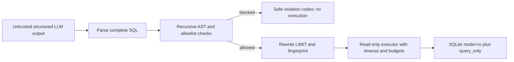

# SQL Security Policy — Tahap 4

- Status: implemented and verified for the local SQLite MVP
- Policy version: `stage-4-v1`
- Parser: SQLGlot 30.12.0
- Dialect: explicit `sqlite`
- Default maximum result rows: 500

## Enforcement Flow



The system prompt is not a security control. `SecureQueryOrchestrator` is the
only runtime path that may move generated SQL to the executor, and it passes the
validator's rewritten SQL rather than the original model string.

## Fail-Closed AST Rules

`SQLSecurityService` requires non-empty SQL within the configured character
budget, parses the entire string using the configured dialect, and accepts
exactly one `Query` AST. Parse failure, dialect mismatch, or multiple statements
produce an unsafe report with no `executed_sql`.

The complete tree is checked for:

- DML: `INSERT`, `UPDATE`, `DELETE`, `MERGE`, and load/write forms;
- DDL and privilege changes: `CREATE`, `ALTER`, `DROP`, `TRUNCATE`, `GRANT`, and
  `REVOKE`;
- transactions and administrative commands, including `COPY`, execute/call,
  pragmas, attach/detach, cache, analyze, lock, and related command nodes;
- `SELECT INTO`, unbound placeholders, recursive CTEs, excessive structural
  complexity, and cartesian or constant-true joins;
- forbidden objects or functions anywhere inside CTEs, subqueries, unions, and
  nested expressions.

## Object and Function Policy

Allowed tables and columns come from the tracked Chinook schema snapshot.
Physical sources are derived from SQL scopes, not trusted from LLM-declared
metadata. Declared and AST-derived sources must agree. Column qualification runs
on a copy of the parsed tree so validation cannot silently change execution
semantics.

Only schema `main` is allowed by default. Sensitive catalogs such as
`sqlite_master`, `sqlite_schema`, `pg_catalog`, `information_schema`, `sys`, and
similar catalogs are blocked. Cross-catalog references are rejected.

Functions are deny-by-default: a function must appear in the reviewed allowlist
and must not appear in either the built-in or configurable blocklist. The
blocklist includes delay, cross-connection, extension loading, file access,
large-object, and external file-reader families such as `pg_sleep`, `dblink`,
`load_extension`, `readfile`, `writefile`, and `read_csv`.

## Rewriting, Budgets, and Audit

The validated outer query receives `LIMIT 500` when missing, negative,
parameterized, non-literal, or above the maximum. A smaller literal limit is
preserved. Generated and executed SQL remain separate response fields.

Execution uses:

- a query-length budget;
- an SQLite progress-handler deadline;
- maximum rows, columns, and serialized response bytes;
- SQLite URI `mode=ro`, `PRAGMA query_only=ON`, and a non-persistent pool;
- sanitized domain errors that do not return driver details.

The validator computes a SHA-256 fingerprint from a normalized AST whose literal
values have been replaced with placeholders. Audit records contain request ID,
decision, fingerprint, derived tables, violation codes, and whether a limit was
applied. They intentionally omit raw question text, raw SQL, and result rows.

## Repair Policy

Repair defaults to at most two attempts. Only parse, unavailable/ambiguous
column, and declared-source mismatch failures are repairable. DML, DDL,
administrative, catalog, function, schema, multi-statement, complexity, and
other security violations are never sent to a repair callback. The callback
receives sanitized codes only, and every candidate goes through the complete
validator again. The deterministic fake runtime keeps repair disabled because
its closed responses should already be valid.

## Configuration

The primary environment settings are:

- `SQL_DIALECT=sqlite`
- `SQL_MAX_QUERY_CHARACTERS=12000`
- `SQL_BLOCKED_FUNCTIONS=[...]`
- `QUERY_MAX_ROWS=500`
- `QUERY_MAX_COLUMNS=100`
- `QUERY_MAX_RESPONSE_BYTES=5000000`
- `QUERY_TIMEOUT_SECONDS=5`
- `QUERY_MAX_REPAIR_ATTEMPTS=2`

`SQL_ALLOW_EXPLAIN` remains false and no EXPLAIN path is enabled in this phase.

## Verification

```powershell
uv run python scripts/dev.py test-security
uv run python scripts/dev.py evaluate-stage4
uv run python scripts/dev.py verify
```

The versioned evaluation blocked 30/30 known-unsafe SQL cases and allowed 20/20
previously accepted baselines, for a measured false-blocking rate of 0%. These
results do not make the SQLite MVP production-ready: authentication,
authorization, tenant isolation, PostgreSQL privileges, rate limiting, and
deployment hardening remain later-stage gates.
